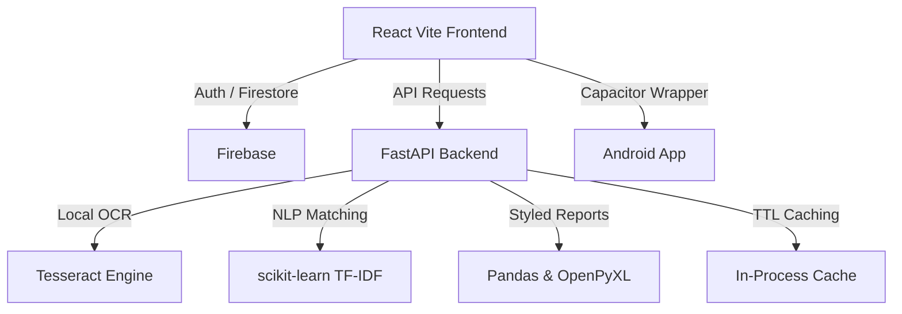

# ✨ MagicCounter — AI Job Application Tracker & Resume Matcher

[](https://fastapi.tiangolo.com/)
[](https://react.dev/)
[](https://firebase.google.com/)
[](https://github.com/tesseract-ocr/tesseract)
[](https://capacitorjs.com/)
[](https://vitejs.dev/)

> **MagicCounter (ZenJob)** is a premium, full-stack, AI-powered application designed to streamline and supercharge your job hunting journey. By leveraging **Local OCR (Tesseract)** and **TF-IDF NLP Matching**, MagicCounter turns messy job screenshots, raw descriptions, and URLs into clean, structured data locally and securely. Furthermore, it automatically evaluates your active resume against job listings to provide instant compatibility scoring, custom skill gap analyses, and dynamic improvement tips.

---

## 🚀 Core Features

### 1. 📸 Local Multimodal Extraction
* **Capture & Upload:** Simply upload a screenshot or image of any job poster.
* **Tesseract OCR:** The system uses local OCR engines to extract raw text without relying on external vision APIs.
* **Rule-Based Structuring:** Advanced regex and rule-based logic extract: *Company Name, Job Role, Location, Job Type, Contact Email, Phone Number, Skills Required, Experience Needed, and Application Link*.

### 2. 🌐 Smart Web Scraper & URL Extraction
* **Direct URL Scraping:** Provide a job posting URL.
* **Auto-Fetch & Structure:** The backend automatically fetches the HTML, filters out boilerplate, and extracts structured job info locally.

### 3. 📄 Live Resume Matcher & Compatibility Scoring
* **Resume Bank:** Upload and manage multiple versions of your resume (PDF, DOC, DOCX support).
* **TF-IDF Alignment:** The system uses **TF-IDF Cosine Similarity** to automatically cross-reference your active resume with every job listing.
* **Granular Feedback:** Get a precise match score percentage, matching skills, missing skills, and personalized career suggestions.

### 4. 📊 "Cyber-Luxe" Command Dashboard
* **Dynamic Kanban/List Tracking:** Track application status using professional categories: *Applied, Test Process, Screening, Pending Response, Selected, and Rejected*.
* **Modal-Based Analysis:** Access deep AI match analysis and edit job details through beautiful, glassmorphism modals instead of redirects.

### 5. 📥 Engineered Excel Export
* **Styled Spreadsheets:** Download a fully formatted Excel workbook with professional **Slate Indigo theme**, custom zebra-striping, and data validation rules.

### 6. 🌓 Dual-Theme "Zen Pearl" UI
* **High Contrast Light Mode:** Optimized "Zen Pearl" light mode with theme-aware CSS variables for perfect visibility.
* **Smooth Transitions:** Premium animations and glassmorphism layouts across all screens.

---

## 🛠️ Tech Stack & Architecture



### Backend
* **FastAPI** — High-performance, asynchronous REST API.
* **Firebase Cloud Firestore** — Scalable, cloud-native storage for jobs and resumes.
* **Pytesseract (Tesseract OCR)** — Local image-to-text extraction.
* **scikit-learn** — Powering TF-IDF cosine similarity for resume matching.
* **In-Process TTL Caching** — Optimized retrieval of job and resume data.

### Frontend
* **React + Vite** — High-speed, responsive development.
* **Firebase Authentication** — Secure, multi-tenant user access.
* **Capacitor JS** — Native Android container support.
* **Lucide React** — Premium iconography.

---

## 📦 Installation & Setup

### Prerequisites
* Python 3.10+
* Node.js v18+
* **Tesseract-OCR Engine** installed on your system ([Download here](https://github.com/UB-Mannheim/tesseract/wiki)).
* A **Firebase Project** with Firestore and Authentication enabled.

### 1. Backend Setup
1. Navigate to the `backend` directory and create a virtual environment:
   ```bash
   cd backend
   python -m venv .venv
   source .venv/bin/activate  # On Windows: .venv\Scripts\activate
   ```
2. Install dependencies:
   ```bash
   pip install -r requirements.txt
   ```
3. Configure your `.env` and `firebase-adminsdk.json` with your Firebase credentials.

### 2. Frontend Setup
1. Navigate to the `frontend` directory:
   ```bash
   cd frontend
   npm install
   npm run dev
   ```

---

## 📅 Project Development Timeline

* **Phase 1: Foundation & AI Extraction (Legacy)**
  * Initial build with React, Vite, and FastAPI.
  * Integration with Gemini Pro for multi-modal extraction.
* **Phase 2: Analytics & Tracking Enhancements**
  * Advanced resume matching and compatibility scoring.
  * Professional styled Excel export functionality.
* **Phase 3: Cloud Migration & Security**
  * Migration to **Firebase Cloud Firestore** and **Firebase Authentication**.
  * Transition to **Local AI Extraction** (Tesseract) for privacy and offline capability.
* **Phase 4: Polish & User Flow (Recent)**
  * Authentication UI/UX refinements (glassmorphism login).
  * Enhanced navigation (Auth "Back" button).
  * Optimized dashboard with modal-driven job analysis.
  * "Zen Pearl" light mode optimization.

---

## 📄 License
This project is licensed under the MIT License. Created with ❤️ by [Harshvardhan](https://github.com/Harshvardhan210).
