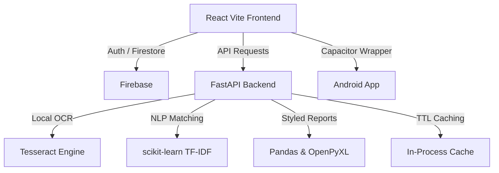

# ✨ ZenJob — Premium AI Job Application Tracker & Resume Matcher

[](https://fastapi.tiangolo.com/)
[](https://react.dev/)
[](https://firebase.google.com/)
[](https://github.com/tesseract-ocr/tesseract)
[](https://capacitorjs.com/)
[](https://vitejs.dev/)

> **ZenJob** is a premium, full-stack, AI-powered application designed to streamline and supercharge your job hunting journey. By leveraging **Local OCR (Tesseract)** and **TF-IDF NLP Matching**, ZenJob turns messy job screenshots, raw descriptions, and URLs into clean, structured data locally and securely. Furthermore, it automatically evaluates your active resume against job listings to provide instant compatibility scoring, custom skill gap analyses, and dynamic improvement tips.

---

## 🚀 Core Features

### 1. 📸 Local Multimodal Extraction
* **Capture & Upload:** Simply upload a screenshot or image of any job poster.
* **Tesseract OCR:** The system uses local OCR engines to extract raw text without relying on external vision APIs.
* **Rule-Based Structuring:** Advanced regex and rule-based logic extract: *Company Name, Job Role, Location, Job Type, Contact Email, Phone Number, Skills Required, Experience Needed, and Application Link*.

### 2. 🌐 Smart Web Scraper & URL Extraction
* **Direct URL Scraping:** Provide a job posting URL.
* **Auto-Fetch & Structure:** The backend automatically fetches the HTML, filters out boilerplate, and extracts structured job info locally.

### 3. 📄 Live Resume Matcher & Compatibility Scoring
* **Resume Bank:** Upload and manage multiple versions of your resume (PDF, DOC, DOCX support).
* **TF-IDF Alignment:** The system uses **TF-IDF Cosine Similarity** to automatically cross-reference your active resume with every job listing.
* **Granular Feedback:** Get a precise match score percentage, matching skills, missing skills, and personalized career suggestions.

### 4. 📊 "Cyber-Luxe" Command Dashboard
* **Dynamic Kanban/List Tracking:** Track application status using professional categories: *Applied, Test Process, Screening, Pending Response, Selected, and Rejected*.
* **Modal-Based Analysis:** Access deep AI match analysis and edit job details through beautiful, glassmorphism modals instead of redirects.

### 5. 📥 Engineered Excel Export
* **Styled Spreadsheets:** Download a fully formatted Excel workbook with professional **Slate Indigo theme**, custom zebra-striping, and data validation rules.

---

## 🛠️ Tech Stack & Architecture



---

## 📦 Installation & Deployment

### Local Setup
1. **Prerequisites**: Python 3.10+, Node.js 18+, Tesseract-OCR.
2. **Backend**: 
   ```bash
   cd backend
   pip install -r requirements.txt
   uvicorn app.main:app --reload
   ```
3. **Frontend**:
   ```bash
   cd frontend
   npm install
   npm run dev
   ```

### 🚀 Deployment (One-Click Blueprint)
This project is pre-configured for **Render** using the `render.yaml` blueprint.
1. Push your code to GitHub.
2. Go to Render Dashboard -> **New Blueprint**.
3. Connect your repo and follow the prompts for your Firebase credentials.

---

## 📄 License
This project is licensed under the MIT License. Created with ❤️ by [Harshvardhan](https://github.com/Harshvardhan210).
