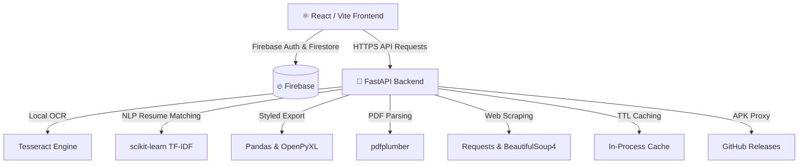

<div align="center">


# ✨ ZenJob

### AI-Powered Job Application Tracker & Resume Matcher

[](https://fastapi.tiangolo.com/)
[](https://react.dev/)
[](https://firebase.google.com/)
[](https://vitejs.dev/)
[](https://www.docker.com/)
[](https://render.com/)

**ZenJob** transforms your job hunt from chaos into clarity. Upload job posters, scrape listings, match your resume — all locally, all securely.

[🌐 Live Demo](https://magiccounter-frontend.onrender.com) · [📥 Download APK](#-mobile-apk) · [🐛 Report Bug](https://github.com/Harshvardhan210/MagicCounter/issues)

</div>

---

## 📖 Table of Contents

- [About](#-about)
- [Features](#-features)
- [Tech Stack](#-tech-stack)
- [Architecture](#-architecture)
- [Getting Started](#-getting-started)
- [Environment Variables](#-environment-variables)
- [License](#-license)

---

## 🎯 About

ZenJob is a **full-stack, AI-powered** job application management platform built for serious job seekers. It uses **local OCR (Tesseract)** and **TF-IDF NLP Matching** to extract structured data from job posters and URLs without sending your data to third-party AI APIs — keeping everything private and fast.

Key differentiators:
- 🔒 **Privacy-first** — all OCR and NLP runs locally on the server, no external AI calls for core features
- ⚡ **Blazing fast** — in-process TTL caching, async endpoints, and optimized Firestore reads
- 📱 **Cross-platform** — works as a web app and as an Android APK (via Capacitor)
- ☁️ **Cloud-synced** — job data syncs across all your devices via Firebase Firestore

---

## 🚀 Features

### 📸 Local Multimodal Extraction
Upload a screenshot or photo of any job poster — ZenJob uses **Tesseract OCR** to extract raw text locally and then applies advanced regex rules to parse:
> Company · Role · Location · Job Type · Contact Email · Phone · Skills · Experience · Application Link

### 🌐 Smart Web Scraper
Provide any job listing URL and ZenJob automatically fetches, parses, and structures the information — no copy-paste required.

### 📄 Live Resume Matcher & Compatibility Scoring
Upload multiple resume versions (PDF / DOC / DOCX). ZenJob uses **TF-IDF Cosine Similarity** to score each job against your active resume and delivers:
- Match score percentage
- Matching & missing skills
- Personalised career suggestions

### 📊 Kanban-Style Command Dashboard
Track every application through professional stages:
`Applied` → `Test Process` → `Screening` → `Pending Response` → `Selected` → `Rejected`

Modal-based deep analysis with glassmorphism UI — no page reloads.

### 📥 Styled Excel Export
Export your entire job pipeline as a formatted Excel workbook with a **Slate Indigo** colour theme, zebra-striping, and column-level data validation.

### 🔗 Direct APK Download
A backend proxy endpoint streams the latest Android APK directly from GitHub Releases — users download from the domain without seeing GitHub.

---

## 🛠 Tech Stack

| Layer | Technology |
|---|---|
| **Frontend** | React 19, Vite 8, Vanilla CSS |
| **Backend** | FastAPI, Uvicorn, Gunicorn |
| **Auth & DB** | Firebase Auth, Cloud Firestore |
| **OCR** | Tesseract OCR via `pytesseract` |
| **NLP** | scikit-learn (TF-IDF Cosine Similarity) |
| **PDF Parsing** | pdfplumber |
| **Web Scraping** | requests + BeautifulSoup4 |
| **Exports** | Pandas + OpenPyXL |
| **Containerisation** | Docker |
| **Hosting** | Render (Free tier — Docker + Static) |
| **Mobile** | Capacitor (Android APK) |

---

## 🏗 Architecture



---

## ⚙️ Getting Started

### Prerequisites

| Tool | Version |
|---|---|
| Python | 3.10+ |
| Node.js | 18+ |
| Tesseract-OCR | 5.x |
| Git | any |

> **Install Tesseract:** [Windows Guide](https://github.com/UB-Mannheim/tesseract/wiki) · [Linux](https://tesseract-ocr.github.io/tessdoc/Installation.html) · [macOS](https://formulae.brew.sh/formula/tesseract)

### 1. Clone the Repository

```bash
git clone https://github.com/Harshvardhan210/MagicCounter.git
cd MagicCounter
```

### 2. Backend Setup

```bash
cd backend

# Create and activate virtual environment
python -m venv .venv
# Windows:
.venv\Scripts\activate
# macOS/Linux:
source .venv/bin/activate

# Install dependencies
pip install -r requirements.txt

# Copy and configure environment variables
cp .env.example .env   # then fill in your values

# Start the development server
uvicorn app.main:app --reload --port 8000
```

Backend will be live at: `http://localhost:8000`
Interactive API docs: `http://localhost:8000/docs`

### 3. Frontend Setup

```bash
cd frontend

# Install dependencies
npm install

# Copy and configure environment variables
cp .env.example .env   # set VITE_API_BASE_URL=http://localhost:8000

# Start the development server
npm run dev
```

Frontend will be live at: `http://localhost:5173`

---

## 🔐 Environment Variables

### Backend (`backend/.env`)

```env
FIREBASE_SERVICE_ACCOUNT_JSON=<your-firebase-admin-sdk-json>
ALLOWED_ORIGINS=http://localhost:5173
GEMINI_API_KEY=<optional-gemini-key>
PORT=8000
```

### Frontend (`frontend/.env`)

```env
VITE_API_BASE_URL=http://localhost:8000
```

---

## 📄 License

This project is licensed under the **MIT License**.

---

<div align="center">

Made with ❤️ by [Harshvardhan](https://github.com/Harshvardhan210)

⭐ Star this repo if you found it useful!

</div>
