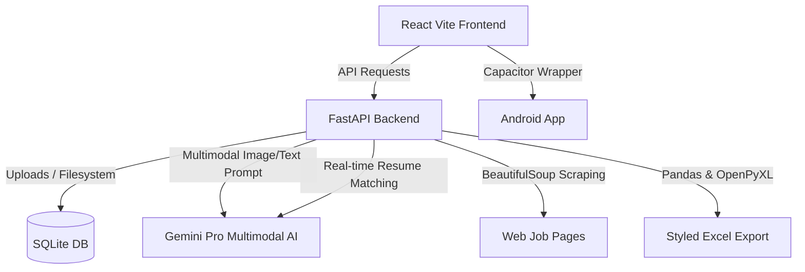

# ✨ MagicCounter — AI Job Application Tracker & Resume Matcher

[](https://fastapi.tiangolo.com/)
[](https://react.dev/)
[](https://deepmind.google/technologies/gemini/)
[](https://capacitorjs.com/)
[](https://sqlite.org/)
[](https://vitejs.dev/)

> **MagicCounter (ZenJob)** is a premium, full-stack, AI-powered application designed to streamline and supercharge your job hunting journey. By leveraging Google's **Gemini Multimodal AI**, MagicCounter turns messy job screenshots, raw descriptions, and URLs into clean, structured data in seconds. Furthermore, it automatically evaluates your active resume against job listings to provide instant compatibility scoring, custom skill gap analyses, and dynamic improvement tips.

---

## 🚀 Core Features

### 1. 📸 Multimodal Image Extraction
* **Capture & Upload:** Simply upload a screenshot or image of any job poster (from LinkedIn, Indeed, Twitter, WhatsApp, or flyers).
* **Instant Structuring:** Gemini extracts critical data points: *Company Name, Job Role, Location, Job Type, Contact Email, Phone Number, Skills Required, Experience Needed, and Application Link*.

### 2. 🌐 Smart Web Scraper & URL Extraction
* **Direct URL Scraping:** Provide a job posting URL.
* **Auto-Fetch & Structure:** The backend automatically fetches the HTML, filters out header/footer boilerplate, parses the text content, and extracts fully structured job info through the AI engine.

### 3. 📄 AI Resume Matcher & Compatibility Scoring
* **Resume Bank:** Upload and manage multiple versions of your resume (supports **PDF, DOC, and DOCX** up to 5MB).
* **Live Alignment Check:** The system automatically cross-references your active resume with every extracted job description.
* **Granular Feedback:** Get a precise match score percentage, list of matching skills, missing skills, and personalized career suggestions to optimize your application.

### 4. 📊 "Cyber-Luxe" Command Dashboard
* **Dynamic Kanban/List Tracking:** Track application status using professional categories: *Applied, Test Process, Screening, Pending Response, Selected, and Rejected*.
* **Interactive CRUD:** Add, view, edit, update, or delete entries seamlessly through a beautiful, dark-themed responsive interface.

### 5. 📥 Engineered Excel Export
* **Styled Spreadsheets:** Download a fully formatted Excel workbook generated dynamically with Pandas and OpenPyXL.
* **Premium Design:** Features a professional **Slate Indigo theme**, custom zebra-striping, auto-fit columns, and data grid-lines.
* **Smart Interactivity:** Built-in drop-down data validation for the **Status** column and **automatic color-coded conditional formatting** for all status cells.

### 6. 📱 Capacitor Mobile Readiness
* **Native Wrappers:** Integrated with Capacitor to easily compile, deploy, and run the React frontend as a native application on Android.

---

## 🛠️ Tech Stack & Architecture



### Backend
* **FastAPI** — High-performance, asynchronous REST API.
* **SQLite & DB Engine** — For persistent local storage of jobs and resumes.
* **Google Generative AI SDK** — Powering multimodal image, text, and resume analysis.
* **BeautifulSoup4 & Requests** — Fast, robust web page parsing.
* **Pandas & OpenPyXL** — Custom styles, dropdown validations, and conditional formatting rules for Excel sheet creation.

### Frontend
* **React + Vite** — High-speed, responsive development and hot module reloading.
* **Capacitor JS** — Native Android container support.
* **CSS & Animation System** — Premium "Cyber-Luxe" layout utilizing bespoke modern components, responsive design, and smooth transitions.

---

## 📦 Installation & Setup

### Prerequisites
* Python 3.10+ installed
* Node.js v18+ & npm installed
* A **Google Gemini API Key** ([Get one here](https://aistudio.google.com/))

### 1. Backend Setup
1. Navigate to the backend directory:
   ```bash
   cd backend
   ```
2. Create and activate a virtual environment:
   ```bash
   python -m venv .venv
   # On Windows:
   .venv\Scripts\activate
   # On macOS/Linux:
   source .venv/bin/activate
   ```
3. Install the dependencies:
   ```bash
   pip install -r requirements.txt
   ```
4. Create a `.env` file in the `backend` folder:
   ```env
   GEMINI_API_KEY=your_actual_gemini_api_key_here
   ```
5. Start the FastAPI server:
   ```bash
   uvicorn app.main:app --reload --port 8000
   ```
   *The interactive docs will be available at [http://127.0.0.1:8000/docs](http://127.0.0.1:8000/docs).*

### 2. Frontend Setup
1. Navigate to the frontend directory:
   ```bash
   cd ../frontend
   ```
2. Install the package dependencies:
   ```bash
   npm install
   ```
3. Start the local Vite development server:
   ```bash
   npm run dev
   ```
   *The frontend dashboard will be running at [http://localhost:5173](http://localhost:5173).*

### 3. Native Android Build (Capacitor)
1. Build the frontend assets:
   ```bash
   npm run build
   ```
2. Sync with Capacitor to update the Android project assets:
   ```bash
   npx cap sync
   ```
3. Open the project in Android Studio:
   ```bash
   npx cap open android
   ```
4. Build, debug, and run the app on an Android emulator or a physical device directly from Android Studio.

---

## 🎨 Professional Styling Showcase (Excel Export)
The exported Excel spreadsheet isn't just a basic CSV. It's an executive-level report:
* **Headers:** Slate Indigo background (`#312E81`) with bold white text.
* **Zebra Rows:** Subtle violet backgrounds (`#F5F3FF`) on alternate rows for ease of reading.
* **Status Dropdowns:** Column `L` features interactive drop-down cells.
* **Conditional Fills:**
  - `Selected` ➡️ Light Green (`#D1FAE5`)
  - `Rejected` ➡️ Light Red (`#FEE2E2`)
  - `Screening` ➡️ Light Purple (`#F3E8FF`)
  - `Applied` ➡️ Light Indigo (`#E0E7FF`)
  - `Test Process` ➡️ Light Orange (`#FFEDD5`)

---

## 📅 Project Development Timeline

* **Phase 1: Foundation & AI Extraction**
  * Initial build with React, Vite, and FastAPI.
  * Local SQLite database configuration.
  * Integration with Gemini Pro Vision for multi-modal image, URL, and text job extraction.
  * Capacitor Native Android wrapper implementation.
* **Phase 2: Analytics & Tracking Enhancements**
  * Advanced AI resume matching and compatibility scoring.
  * Enhanced Kanban/List job tracking with visual status indicators.
  * Professional styled Excel export with drop-down data validation and conditional formatting.
* **Phase 3: Cloud Migration & Security (Recent)**
  * Complete migration to **Firebase Cloud Firestore** for scalable, cloud-native storage.
  * Implementation of **Firebase Authentication** for secure, multi-tenant user access.
  * Secure management of Firebase Admin SDK credentials and environment variables.
* **Phase 4: Polish & User Flow**
  * Authentication UI/UX refinements (glassmorphism login/register screens).
  * Seamless authentication routing and automatic sign-out flow on registration.

---

## 📄 License
This project is licensed under the MIT License. Created with ❤️ by [Harshvardhan](https://github.com/Harshvardhan210).
